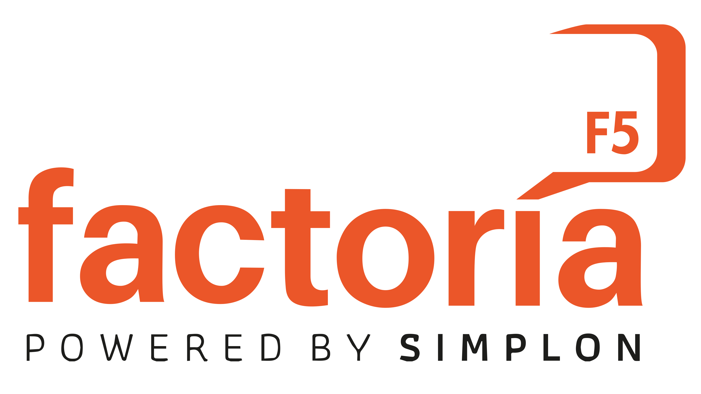
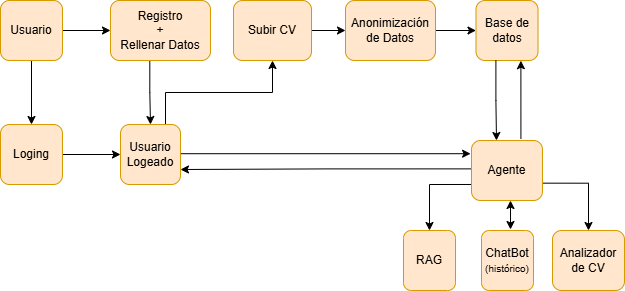

<p align="center">
  
</p>


<h1 align="center">🧭 ORIENTATECH - Agente de Reorientación Tecnológica</h1>

<p align="center">
  Agente inteligente para reconversión laboral hacia empleos tech • Dockerizado & desplegado en Kamatera • FastAPI + React + LangChain + PostgreSQL
</p>

---

## 📚 Tabla de Contenidos

- [📌 Descripción del Proyecto](#-descripción-del-proyecto)
- [📎 Enlaces Útiles](#-enlaces-útiles)
- [🎯 Público Objetivo](#-público-objetivo)
- [⚙️ Funcionalidades y Limitaciones](#️-funcionalidades-y-limitaciones)
- [🚀 Mejoras Futuras](#-mejoras-futuras)
- [🛠️ Tecnologías Utilizadas](#-tecnologías-utilizadas)
- [🧠 Arquitectura del Sistema](#-arquitectura-del-sistema)
- [✍ Instrucciones de Despliegue](#-instrucciones-de-despliegue)
- [👩‍💻 Colaboradores](#-colaboradores)

---

## 📌 Descripción del Proyecto

<p align="justify">
  
**Orientatech** es una plataforma inteligente diseñada para ayudar a personas que desean **reconvertirse profesionalmente hacia empleos tecnológicos**.  
El sistema utiliza un **agente con bases de datos relacional y vectorial**, combinando capacidades de **RAG (Retrieval-Augmented Generation)** y **Groq**, para ofrecer **análisis personalizados**, **sugerencias de formación** y **orientación profesional** a los usuarios.

Los usuarios pueden **registrarse (autenticación JWT)**, **subir su CV**, y **recibir un análisis automático** del mismo.  
Un script interno **anonimiza los datos del CV antes de almacenarlos** en la base de datos, garantizando la privacidad y cumplimiento con buenas prácticas de seguridad.

Además, el agente cuenta con un **chat inteligente** con el que los usuarios pueden interactuar para obtener:
- Recomendaciones de **cursos y rutas de aprendizaje**
- **Ofertas laborales** actualizadas
- Consejos personalizados para la transición al mundo tech
- Seguimiento gracias a su memoria

El sistema está **contenedorizado con Docker** y **desplegado en Kamatera**, combinando un **stack moderno** y optimizado para escalabilidad y rendimiento.

---

## 📎 Enlaces Útiles

- **WebApp (Demo)**
- 
[www.orientatech.es](http://103.45.245.6/)


- **Documentación Técnica**
  
[www.deepwiki.com/documentation/orientatech]()


- **Presentación**
[www.canva.com/design/orientatech](https://www.canva.com/design/DAG1q4CnHkg/HvdNOgXSaT4nmETOz0scMw/view?utm_content=DAG1q4CnHkg&utm_campaign=designshare&utm_medium=link2&utm_source=uniquelinks&utlId=hfc936a4c34)


---

## 🎯 Público Objetivo

- Personas que desean **reconvertirse profesionalmente** hacia el sector tecnológico.
- **Instituciones educativas** o **programas de empleabilidad** enfocados en transición laboral.
- **Reclutadores** o **mentores tech** que buscan analizar perfiles y ofrecer orientación.

---

## ⚙️ Funcionalidades y Limitaciones

### ✅ Funcionalidades

- **Registro y autenticación segura (JWT)**  
- **Subida y anonimización automática de CVs**
- **Análisis personalizado del perfil profesional**
- **Chat inteligente** con recomendaciones de empleabilidad
- **Base de datos de cursos y plataformas de empleo** integradas
- **Despliegue completo en Docker + Kamatera**
- **RAG y Groq** para búsqueda semántica y generación de respuestas
- **Análisis NLP** mediante **spaCy**, **LangChain**, y **Transformers**

### ⚠️ Limitaciones

- El análisis depende de la **calidad y formato del CV**.
- Actualmente soporta CVs en **PDF y texto plano**.
- El modelo de recomendación se basa en **fuentes de cursos y empleos predefinidas**.
- La versión actual está optimizada para **español e inglés**.

---

## 🚀 Mejoras Futuras

- Implementar un **sistema de matching dinámico** con APIs de empleo en tiempo real.  
- Integrar **perfiles de LinkedIn y GitHub** para enriquecer el análisis.  
- Desarrollar un **dashboard para mentores y reclutadores**.  
- Añadir soporte para **más idiomas y países**.  
- Entrenamiento de modelos **propios de clasificación de habilidades**.

---

## 🛠️ Tecnologías Utilizadas

### ⚙️ Backend


### 🌐 Frontend


### 🧱 Base de Datos e Infraestructura


---

## 🧠 Arquitectura del Sistema

- **Ingesta de datos:** CVs de usuarios (PDF o texto plano)
- **Anonimización automática:** Eliminación de datos personales antes de inserción
- **Análisis NLP:** Extracción de habilidades y experiencias con spaCy y Transformers
- **RAG + Groq:** Generación de recomendaciones con contexto
- **Bases de datos:**  
- Relacional (PostgreSQL + Neon)  
- Vectorial para embeddings de documentos y consultas
- **Chatbot interactivo:** Implementado con LangChain, Groq y FastAPI
- **Despliegue:** Docker + Kamatera
  
<br>
</br>
<p align="center">

</p>

---

## ✍ Instrucciones de Despliegue

1. **Clonar el repositorio**
   ```
   git clone https://github.com/your-repo/orientatech.git
   cd orientatech
   ```
   
2.- **Configurar variables de entorno**
```
Copia .env.example a .env y agrega tus claves JWT, conexiones a Neon y credenciales de Kamatera.
```

3.- **Ejecutar con Docker**
```
docker-compose up --build
```

4.- **Acceder a la aplicación**
```
http://localhost:5173

```

---

## 👩‍💻 Colaboradores

Equipo apasionado por la inteligencia artificial aplicada a la empleabilidad y la educación.


| Name                  | GitHub                                                                                                                   | LinkedIn                                                                                                                                             |
|-----------------------|--------------------------------------------------------------------------------------------------------------------------|------------------------------------------------------------------------------------------------------------------------------------------------------|
| **Yael Parra**        | [](https://github.com/Yael-Parra)       | [](https://www.linkedin.com/in/yael-parra/)                   |
| **Maryna Nalyvaiko**  | [](https://github.com/MarynaDRST)       | [](https://www.linkedin.com/in/maryna-nalyvaiko-69745a236/)   |
| **Veida Velazquez**   | [](https://github.com/DarthVada36)      | [](https://www.linkedin.com/in/vadavelazquez/)                |
| **Juan Carlos Macías** | [](https://github.com/juancmacias)     | []([https://www.linkedin.com/in/nhoeli-salazar/](https://www.linkedin.com/in/max-beltran/))               |


